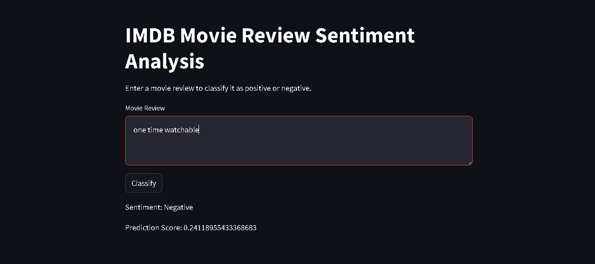
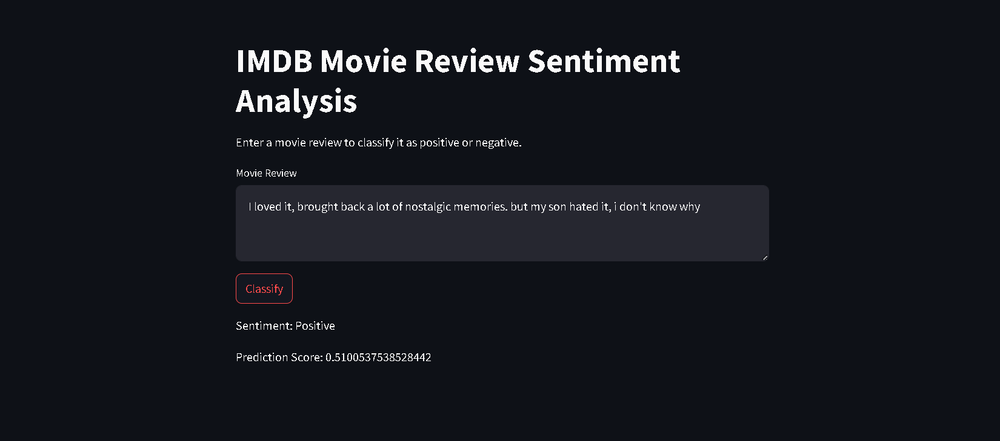

# 📚 Simple RNN-Based IMDB Movie Review Sentiment Analysis

**A deep learning project utilizing a Recurrent Neural Network (RNN) to classify IMDB movie reviews as positive or negative, featuring an interactive Streamlit web application.**

## 🚀 Overview

This project implements a simple RNN model to perform sentiment analysis on IMDB movie reviews. The model is trained to predict whether a given movie review expresses a positive or negative sentiment. An interactive user interface is provided through Streamlit, allowing users to input their own reviews and receive real-time sentiment predictions.

## 🛠️ Technologies Used

- **TensorFlow/Keras**: For building and training the RNN model.
- **Pandas & NumPy**: For data processing and manipulation.
- **Streamlit**: For creating an interactive web application.

## 🌐 Live Demo

Try the live demo here: **[Live App](https://simplernnimdb-9q33sxitgxu8efbsvwmhc2.streamlit.app/)**

## 📂 Project Structure

- `main.py`: Streamlit application script.
- `simplernn.h5`: Pre-trained RNN model file.
- `requirements.txt`: List of required Python packages.
- `README.md`: Project documentation (this file).
- `img1.png` & `img2.png`: Sample images from the project.

## 🛠️ Setup and Installation

1. **Clone the Repository**

   ```bash
   git clone https://github.com/laavanjan/Simple_RNN_imdb.git
   cd Simple_RNN_imdb
   ```

2. **Create and Activate a Virtual Environment**

   ```bash
   python3 -m venv venv
   source venv/bin/activate  # On Windows, use venv\Scripts\activate
   ```

3. **Install Dependencies**

   ```bash
   pip install -r requirements.txt
   ```

## 🏃‍♂️ Usage

1. **Run the Streamlit App**

   ```bash
   streamlit run main.py
   ```

2. **Interact with the App**

   - Open your browser and navigate to `http://localhost:8501`.
   - Enter a movie review in the text box provided.
   - Click the "Classify" button to see the predicted sentiment and confidence score.

## 📊 Model Training

The RNN model was trained on the IMDB dataset, which contains 25,000 movie reviews labeled as positive or negative. The training process involved:

- Tokenizing and padding the text data.
- Building a Sequential model with an Embedding layer and a SimpleRNN layer.
- Compiling the model with the Adam optimizer and binary cross-entropy loss function.
- Training the model over multiple epochs with a batch size of 32.

## 📈 Performance

The model achieves an accuracy of approximately 85% on the test dataset, demonstrating its effectiveness in classifying movie review sentiments.

## 📷 Screenshots

Sample images from the project:





## 🤝 Contributing

Contributions are welcome! Please feel free to submit a Pull Request.

## 📄 License

This project is licensed under the MIT License.

---


